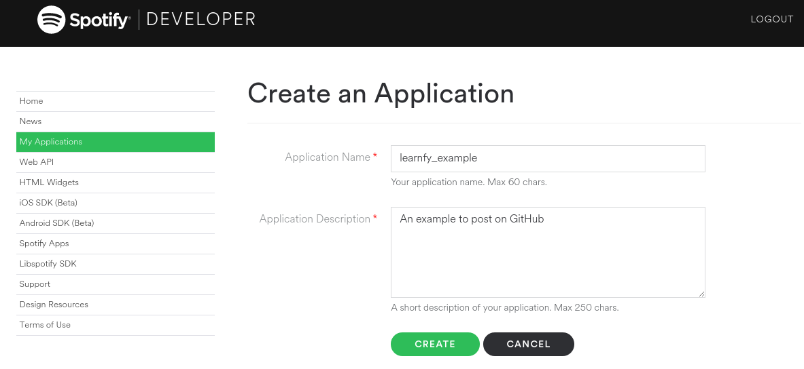
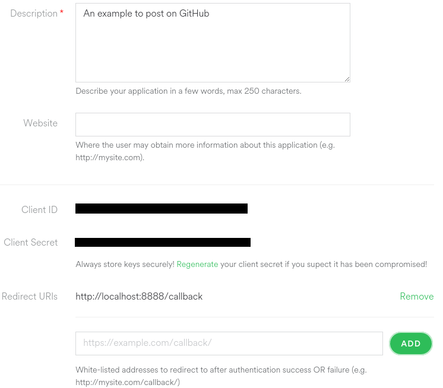
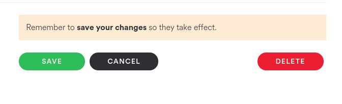

<p align="center">

</p>

## learnfy

> Create a music genre dataset (metadata or audio) for classification using the Spotify Web API.

*Disclaimer: It's not a Spotify product and isn't associated with the company.*

### Intro

Learnfy is a webapp to help you to create a dataset of songs for music genre classification. 

### Resources

### Setting up

#### Clone the repo

```bash
$ git clone https://github.com/Hguimaraes/learnfy
$ cd learnfy
$ npm install && bower install
```

#### Create your app on the Spotify developer page

1. Go to the [Spotify developer](https://developer.spotify.com/) page and click in the "My apps" tab
2. Click on the "Create an app" button
3. Fill the information as the following

<p align="center">

</p>

4. Add the URL http://localhost:8888/callback to your Redirect URIs

<p align="center">

</p>

5. Save your Client ID and Client Secret. Don't forget to save this edit before leaving the page

<p align="center">

</p>

#### Create the env file

```bash
$ mv .env.example .env
```

And edit the .env file with your favorite text editor and place your client ID and client secret in the correct line (without "").

#### Change the config file (optional)

You can edit the *config/config.js* file to change the place where you will save the data. By default it will save on the *dataset* folder.

#### Run the app

```bash
$ node learnfy
```

or if you already have an bkp file and want to create an exact dataset of it:

```bash
(@TO-DO)$ node learnfy --restore mybkpfile.bkp
```

Where *mybkpfile.bkp* is the path to your backup file.

### Legal information

> Read carefuly the [Terms of Use](https://developer.spotify.com/developer-terms-of-use/) of the Spotify API